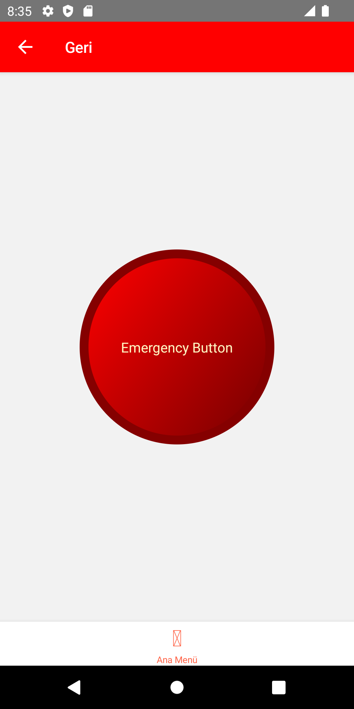

# EARTHQUAKE APP

*
This is a main menu of app
*

*There are three main goal on Earthquake app.* 
- ## ***First: İnformation about earthquake***

- ## ***Second: Gathering Areas in Bursa.***

*
Select your district and village
*

*
See where's your gathering area
*

 
- ##  ***Third: Alarm button***

